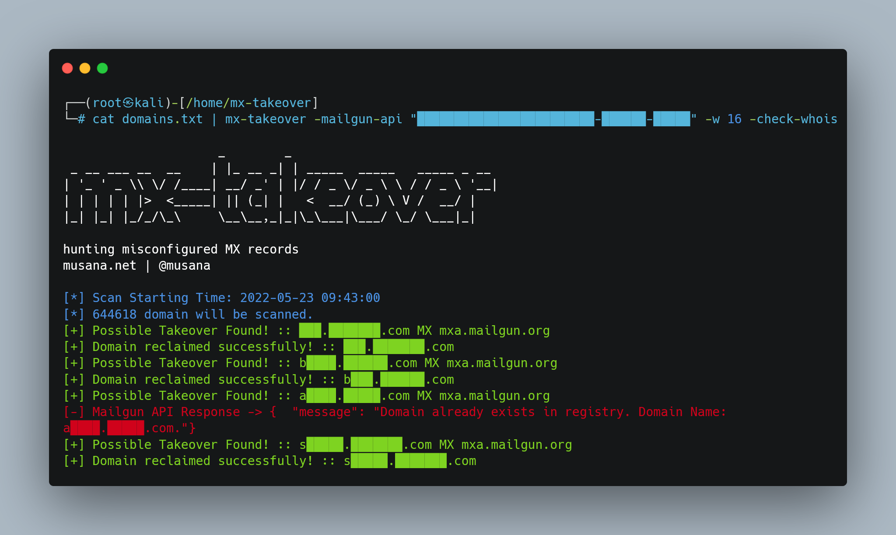
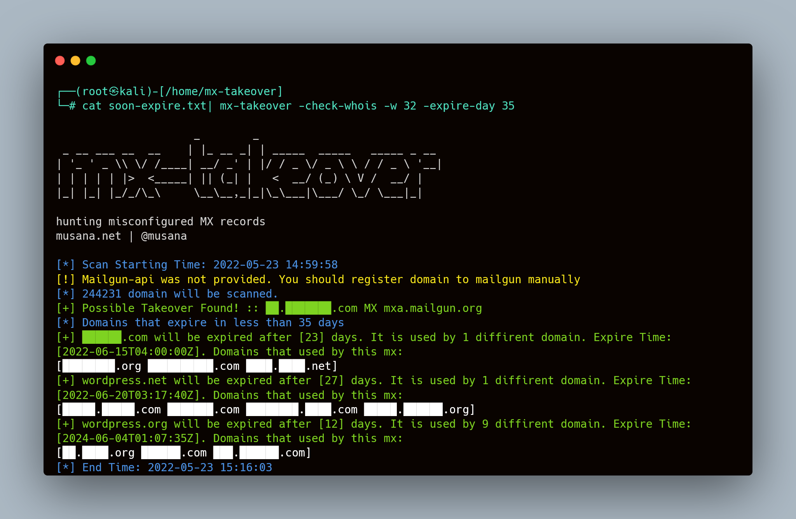
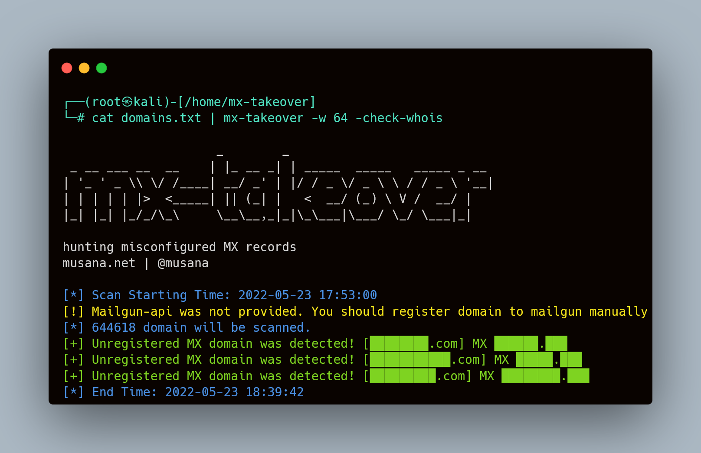

<h1 align="center">
  mx-takeover
  <br>
</h1>


<p align="center">
  <a href="https://pkg.go.dev/github.com/musana/mx-takeover#section-readme"></a>
  <a href="https://goreportcard.com/report/github.com/musana/mx-takeover"></a>
  <a href="https://opensource.org/licenses/MIT"></a>
  <a href="https://twitter.com/musana"></a>
</p>

<p align="center">
  <a href="#how-to-works">How to works</a> •
  <a href="#features">Features</a> •
  <a href="#installation-instructions">Installation</a> •
  <a href="#usage">Usage</a> •
  <a href="#running-mx-takeover">Running mx-takeover</a>
</p>


**mx-takeover** focuses DNS MX records and detects misconfigured MX records. It currently support three technique. These are,
- MX domains that will expire soon
- Unregistered MX domains
- Domains that points to not currently in use by mailgun.

 
# How to works
### Attack Scenario for Mailgun  
1. Your company starts using a new service for emails.
2. Your company's mx record points to mailgun. (eg: sub.domain.com MX mxa.mailgun.com)
3. Your company stops using mailgun but does not remove the mx record from DNS
4. Attacker signs up for the mailgun and claims the domain as theirs. No verification is done by the mailgun, and the DNS-setup is already correctly setup.
5. Attacker can now read mail that sent associated the domain. (\<something\>@sub.domain.com)

**Limitation**  
Mailgun uses MX records for mail receiving, TXT records for mail sending and CNAME record for tracking. Of these records only the DKIM record is unique and generated randomly. 

Therefore, can not be sent mails on behalf of someone else, but can be read(receive) mails sent by someone else to associated domain.

# Features

<h1 align="center">
  </a>
  <br>
</h1>

 - Domains deleted in mailgun but MX records held
 - Reclaiming domain automatically
 - Unregistered/expire MX domain
 - MX Domain that will expire soon
 - Domains that used same MX records
 - Saving scan results as json format
 - Support for concurrency


# Installation Instructions

mx-takeover requires **go1.17** to install successfully. Run the following command to install.

```sh
go install -v github.com/musana/mx-takeover@latest
```

# Usage

```sh
mx-takeover -h
```

This will display help for the tool.


```console
┌──(root㉿kali)-[/home/mx-takeover]
└─# mx-takeover -h

                     _        _
 _ __ ___ __  __    | |_ __ _| | _____  _____   _____ _ __
| '_ ' _ \\ \/ /____| __/ _' | |/ / _ \/ _ \ \ / / _ \ '__|
| | | | | |>  <_____| || (_| |   <  __/ (_) \ V /  __/ |
|_| |_| |_/_/\_\     \__\__,_|_|\_\___|\___/ \_/ \___|_|

hunting misconfigured MX records
musana.net | @musana

  -check-whois
        Check whois for detecting unregistered mx domain or will be expire soon
  -expire-day int
        Estimated days for expiration (default 30)
  -h    help
  -mailgun-api string
        mailgun api for domain takeover automatically
  -output string
        Save output to file as json
  -show-only-mx
        show only that have mx records
  -v    Print all log
  -w int
        number of worker (default 32)

```

# Running mx-takeover

### Takeover & Reclaim
<h1>
  </a>
  <br>
</h1>

### Expiring Soon MX Domains

<h1>
  </a>
  <br>
</h1>

### Unregistered MX Domains
<h1>
  </a>
  <br>
</h1>

### Save Scan Result

```bash
┌──(root㉿kali)-[/home/mx-takeover]
└─# cat sdomain.txt| mx-takeover -check-whois -w 64 -output mx.json

                     _        _
 _ __ ___ __  __    | |_ __ _| | _____  _____   _____ _ __
| '_ ' _ \\ \/ /____| __/ _' | |/ / _ \/ _ \ \ / / _ \ '__|
| | | | | |>  <_____| || (_| |   <  __/ (_) \ V /  __/ |
|_| |_| |_/_/\_\     \__\__,_|_|\_\___|\___/ \_/ \___|_|

hunting misconfigured MX records
musana.net | @musana

[*] Scan Starting Time: 2022-05-23 15:15:22
[!] Mailgun-api was not provided. You should register domain to mailgun manually
[*] 141 domain will be scanned.
[*] Domains that expire in less than 30 days
[*] Scan results was saved to mx.json
[*] End Time: 2022-05-23 15:15:24
```

The keys are mx domains. The values are domain that used by specified domain in the key. 

```bash
┌──(root㉿kali)-[/home/mx-takeover]
└─# cat mx.json| jq .
```
```json
{
  "google.com": [
    "_cisco-uds._tcp.wordcamp.org"
  ],
  "maximum.nl": [
    "mcdonalds.maximum.nl"
  ],
  "naver.jp": [
    "line.naver.jp"
  ],
  "slgnt.eu": [
    "leveranciersmail.bol.com"
  ],
  "wordpress.net": [
    "_cisco-uds._tcp.wordpress.net"
  ],
  "wordpress.org": [
    "92.wordpress.org",
    "_cisco-uds._tcp.planet.wordpress.org",
    "_cisco-uds._tcp.profiles.wordpress.org",
    "_cisco-uds._tcp.wordpress.org",
    "_cisco-uds.planet.wordpress.org",
    "_cisco-uds.profiles.wordpress.org",
    "93.wordpress.org",
    "94.wordpress.org",
    "95.wordpress.org"
  ]
}

```


**Important Uptade (15.06.2022):** Mailgun now requires DNS verification for all records(MX, TXT, CNAME) even only for mail receiving. Before fix, in order to receive mail was just enought MX verification.  About three week ago, this was working but vulnerability have fixed now by mailgun. It was sending successfully when mail was sent before and you could access mail content from Maigun logs but now you are getting "relaying denied" error. If you try send you will get `Remote Server returned '550 5.7.367 Remote server returned not permitted to relay -> 550 5.7.1 Relaying denied'` error.
